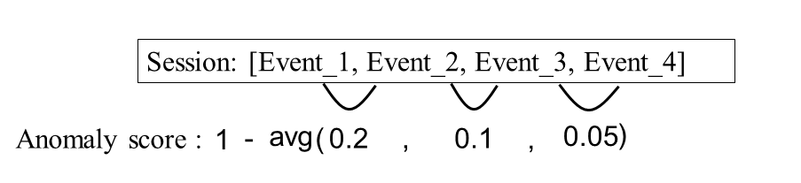
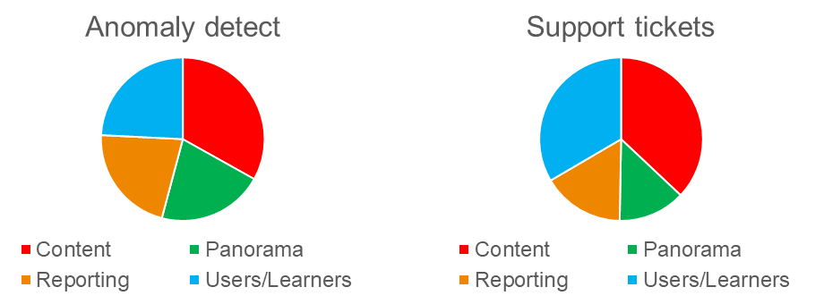

## Detect user struggle for SaaS e-learning platform

SaaS learning platform can help B2B or B2C organization to quickly create beautiful learning site for all device with no coding necessary. This kind of platform also offers tons of features that drive high engagement, learner proficiency, and retentions rate which will make your e-learning site more creative and powerful than the traditional ones.But with all these flexiblity, the platform can be very complex for new users and users can often get confused or lost. To solve this problem, the company would have to provide a lot of trainings to get their user familiar with their platform. In this case, **find where the user struggle is extremely important to guide their training focus areas.**

### Markov Model: derive transition probability matrix from the clickstream data

In this project, I used 10M+ clickstream data for a SaaS learning platform. This data contains sequence of events created by the users and tracks the users’ click path when they are using the platform. But none of this data are labelled. Since outcome of this project will be used to guide important decisions, I would like build something explainable. I decided to go with Markov model.

 
 
The Markov model is assumed that future states depend only on the current state, not on the events that occurred before it. Using the Markov model, I can derive the transition probability matrix from the users’ click stream data. Here I am showing you the Markov chain to help you visualize the transition probability matrix. For example, if a user lands on P0, there is 27% of chance that the user is going to transit to P1 for the next step.

### Define anomaly score

How to use the transition probability matrix to detect anomaly? I’m giving an example here. Here is a random session that has 4 events. I can use the transition probability matrix to assign the probability between events. For example, from event 1 to event 2, the transition probability is 0.2, from 2 to 3 is 0.1, from 3 to 4 is 0.05. If the average transition probability of a path is extremely low which means this click path is really rare and that could indicate the user is confused or lost on the platform. Thus, I define the anomaly score as one minus the average path probability and high anomaly score indicates high probability of user struggle/confusion.

### Validation by support tickets

There are 24 topics for the pages in the platform. Here I’m showing you the topics with the most anomaly detected by the model. They are content, panorama, reporting and users/learners. Similarly, the topics gets most number of support tickets are also content, panorama, reporting, user/learners. Even though it is not a perfect match between these two distribution but this model captures the main trend of user struggle.

Your Pages site will use the layout and styles from the Jekyll theme you have selected in your [repository settings](https://github.com/chengfangzhou20/chengfangzhou20.github.io/settings). The name of this theme is saved in the Jekyll `_config.yml` configuration file.

### Support or Contact

Having trouble with Pages? Check out our [documentation](https://docs.github.com/categories/github-pages-basics/) or [contact support](https://github.com/contact) and we’ll help you sort it out.
